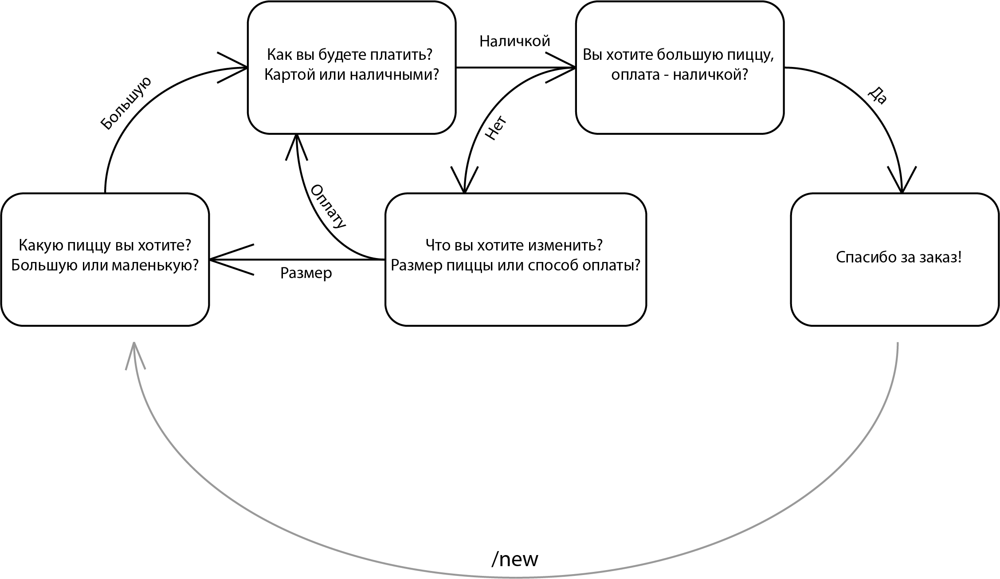

# Bot_operator

### Bot use state machine https://github.com/pytransitions/transitions

----

#### Instruction:

1. First you have to install packages. Enter in command line:
>pip install -r requirements.txt

you have to be in the directory with the 'requirements.txt' or add the path to it:
>pip install -r /path/to/requirements.txt

2. Choose bot type. In the same directory enter in command line:

- to run facebook bot (plug):
>python manage.py fb

- to run skype bot (plug):
>python manage.py skype

- to run telegram bot (work):
>python manage.py tg

    supports '/start' and '/new' commands

- to run vkontakte bot (plug):
>python manage.py vk

